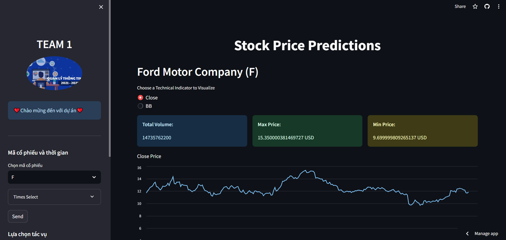

# Prediction Stock With Python Project



## Những việc sẽ làm (Table of contents)
- [Cài Đặt](#cách-cài-đặt)
- [Sử Dụng](#cách-sử-dụng)
- [Mục đích dự án](#mục-đích-dự-án)
- [Đóng Góp](#đóng-góp)
- [Tác giả](#đóng-góp)
- [Bản Quyền](#giấy-phép)

## Mục Đích Dự Án

Dự án này tập trung vào việc phát triển một hệ thống dự đoán giá cổ phiếu bằng Python. Chúng ta sẽ sử dụng các kỹ thuật học máy để phân tích dữ liệu lịch sử và dự đoán xu hướng giá cổ phiếu trong tương lai.

## Cách Cài Đặt

1. Clone dự án về máy local của bạn:

    ```bash
    git clone https://github.com/davisduccopny/Stock-Prediction-with-Python-project.git
    ```

2. Di chuyển vào thư mục dự án:

    ```bash
    cd Stock-Prediction-with-Python-project
    ```

3. Tạo môi trường ảo (nếu cần):

    ```bash
    virtualenv venv
    ```

4. Kích hoạt môi trường ảo:

    - Trên Windows:

        ```bash
        venv\Scripts\activate
        ```

    - Trên macOS/Linux:

        ```bash
        source venv/bin/activate
        ```
    - Trên môi trường streamlit:
        ```bash
        pip freeze > requirements.txt
        ```
5. Cài đặt các thư viện cần thiết:

    ```bash
    pip install -r requirements.txt
    ```

## Cách Sử Dụng

1. Chạy notebook `main_train.ipynb` để xem quy trình dự đoán chi tiết.

2. Tùy chỉnh các tham số và mô hình theo nhu cầu của bạn.

3. Theo dõi các kết quả dự đoán và điều chỉnh mô hình để cải thiện hiệu suất.

## Cấu Trúc Thư Mục

- `dataset/`: Chứa dữ liệu lịch sử về giá cổ phiếu.
- `train_folder/`: Chứa các notebook Jupyter cho phân tích và dự đoán.
- `asset/image/`: Lưu trữ ảnh của dự án
- `info_stock/`: Lưu trữ thông tin cổ phiếu.

## Đóng Góp

Nếu bạn muốn đóng góp vào dự án, hãy tạo một nhánh mới và gửi yêu cầu kéo (pull request). Chúng ta sẽ rất vui khi nhận được sự đóng góp của bạn!

## Tác Giả

- Tên: [Data Team - QuocChienDuc]
- Email: 2156210125@hcmussh.edu.vn
- Thành viên dự án:
    - Hoàng Xuân Quốc - 2156210125
    - Đặng Hoàng Chiến - 2156210095
    - Nguyễn Viết Đức - 2156210100
- GitHub: [Your GitHub Profile](https://github.com/davisduccopny/)

## Giấy Phép

Dự án này được phân phối dưới giấy phép [MIT License](LICENSE).

---
Happy coding!
